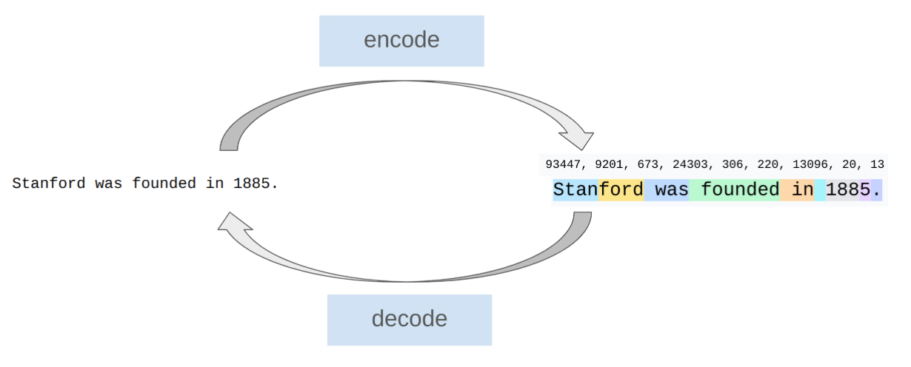
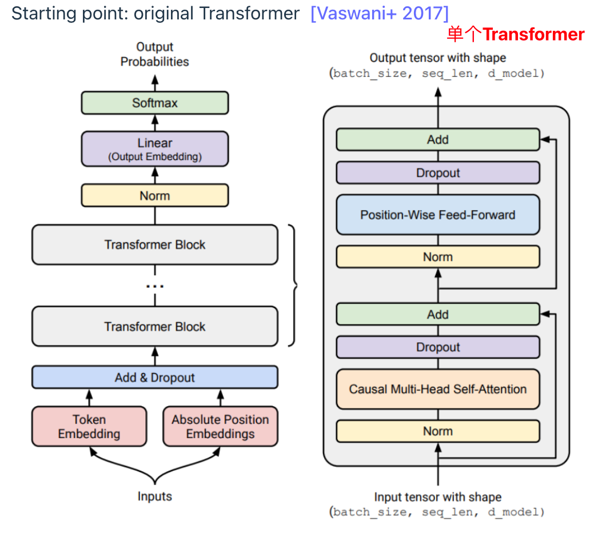
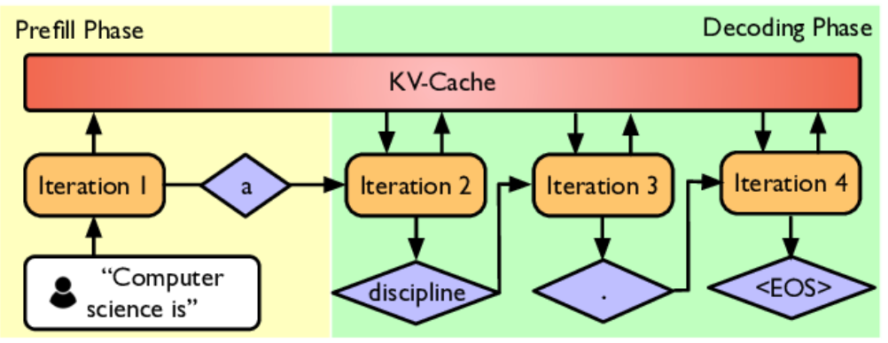
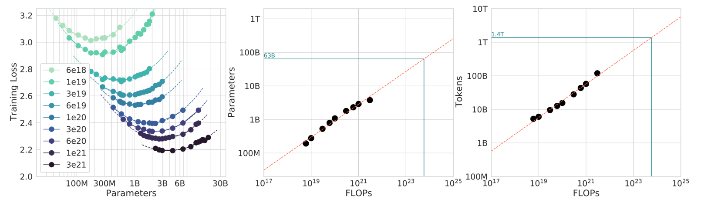

# CS336

## Basics

**Goal**: get a basic version of the full pipeline working

**Components**: tokenization, model architecture, training

---

**data不一定越多越好，有效的data才是**

### Tokenization

将String转换成Integer sequence，每个int代表一个token



也有部分不用tokenizer的方法，直接使用Byte，但这目前不用于工业；本实验使用**Byte Pair Encoding**

`hello world, hello world`分词结果为`24912, 2375, 11, 40617, 2375`，几个**insights**:

- 将`,`也进行分词
- `hello -> 24912` `' 'hello -> 40617` `' '' 'hello -> 220, 40617`，即会将单词前的第一个空格合并一起分词，空格前的空格当成普通的单独字符
- 如果是数字，会每个数字进行分词
- *compression_ratio*压缩比 = 原始文本转换为byte的长度 / token序列长度，即一个token代表多少byte

#### Character tokenizer

每个character作为一个token

压缩比不是1！因为一个character不一定是一个字节，UTF8中emoji 4字节，中文 3字节...

但是显然，这压缩比并不高，也会造成一个很大的vocabulary

#### Byte tokenizer

将每个character先用UTF8等encoding变成byte，然后每个byte tokenization

compression ratio = 1

#### Word tokenizer

每个单词作为一个token

GPT2首先用复杂的正则表达式得到每个单词:

```python
# GPT2正则表达式，普通的正则表达式会把'单独分出来，这会造成语义上的干扰
r"""'(?:[sdmt]|ll|ve|re)| ?\p{L}+| ?\p{N}+| ?[^\s\p{L}\p{N}]+|\s+(?!\S)|\s+"""
# 输入
"I'm learning LLM!"
# 输出
["I", "'m", "learning", "LLM", "!"]
```

这会造成vocabulary unbounded！

#### BPE tokenizer

Byte Pair Encoding

GPT2首先用word-based tokenization来分割，然后在分割后的每个segment上使用BPE algorithm

##### 核心思想

**高频字符序列合并为新 token，低频序列保持拆分**

##### 原理

1. 起始每个byte作为一个token
2. 计算每对相邻token的出现次数

2. 合并出现最频繁的相邻token，将新的这个token添加到vacabulary中
3. 重复执行2, 3，直到达到想要的合并次数`num_merges`

##### Further

单纯使用BPE算法很低效，每次merge都要重复便利，在Assignment中:

- 避免全量遍历所有 merge 规则
- 支持`<|endoftext|>`这类特殊token
- 像GPT2一样先用正则表达式进行pre-tokenization

### Architecture

基础Transformer架构：



### <a href="../assignment1-basics">Assignment</a>

- Implement **BPE** tokenizer

- Implement **Transformer, cross-entropy loss, AdamW optimizer, training loop**

- Train on ***TinyStories*** and ***OpenWebText***

- Leaderboard: minimize ***OpenWebText*** perplexity(困惑度) given 90 minutes on a H100


## Systems

**Goal:** squeeze the most out of the hardware 

**Components:** kernels, parallelism, inference

---

### Kernel

在芯片中，数据在**DRAM**和**SRAM+Compute Unit**中来回移动，这带来了Bandwith Cost。所以应该减少这样的移动从而带来最大化GPU利用率

### Parallelism

而当涉及到多卡的时候，GPU之间的通信成为新的bottleneck，同时**最小化数据移动**仍然重要。但是在多GPU的情况下，有一些额外的操作：使用collective operations，shard分片等

### Inference

即给定`prompt`，模型逐个生成后续`tokens`。推理不是训练，而是应用模型！

Globally, inference compute (every use) exceeds training compute (one-time cost)

Inference分为两部分：prefill和decode



- **prefill** phase 预填充，**一次性**对输入的`prompt`进行处理，是**compute-bound**
- **decoding** phase 解码，逐个生成新`token`，每步都基于上一步，是**memory-bound**。decode的优化方式：Use cheaper model，Speculative decoding，Systems optimizations
  - Use cheaper model，指通过**Pruning**剪枝移除不重要权重、**Quantization**量化降低为FP16/INT8精度、**Distillation**蒸馏为小模型
  - Speculative decoding，指用一个小的*draft model*进行预测多个token，然后用模型进行并行打分，若合理则采用
  - Systems optimizations，通过KV Cache和Batch批处理等方式

### <a href="../assignment2-systems">Assignment</a>

- Implement a **fused(融合的) RMSNorm** kernel in Triton

- Implement **distributed** data parallel training

- Implement optimizer state **sharding**    

- Benchmark and profile the implementations


## Scaling laws

**Goal**: do experiments **at small scale**, predict hyperparameters/loss at large scale

---

给定一个固定的计算预算（FLOPs = 浮点运算次数），应该如何分配？

- 是训练一个更大的模型（更多参数 N）
- 还是训练更长时间（更多数据 D）



左图：对于每个固定的 token 数量，随着模型变大，损失先下降后上升，都呈现“U型”

中图：计算量随模型大小线性增长

右图：计算量随数据量大小线性增长

近似有`D = 20N`，即1.4B的模型要28B的tokens（但未考虑inference cost）

### <a href="../assignment3-scaling">Assignment</a>

- We define a training API (hyperparameters -> loss) based on previous runs  

- Submit "training jobs" (under a FLOPs budget) and gather data points

- Fit a scaling law to the data points

- Submit predictions for scaled up hyperparameters

- Leaderboard: minimize loss given FLOPs budget

## Data

训练模型与评估模型都需要data

### Curation

通过webpages crawled from the Internet, books, arXiv papers, GitHub code等获取。HTML、PDF和目录结构，并非直接可用的文本格式。

### Process

- Transformation: convert HTML/PDF to text (preserve content, some structure, rewriting)
- Filtering: 通过classifier移除无用/低质量信息
- Deduplication: 用Bloom filters或者Min Hash去重

### Evaluation

- Perplexity 困惑度，模型平均每个词的“不确定性”的指数，基于交叉熵损失
- 用MMLU（大规模多任务语言理解），HellaSwag，GSM8K等基准测试来评估模型性能
- Instruction following 评估模型遵循自然语言指令的能力
- Scaling test-time compute 可以用CoT思维链、Ensembling集成多次采样提高表现
- 生成式task可以用LLM-as-Judge
- Full system: RAG, agents

### <a href="../assignment4-data">Assignment</a>

- Convert ***Common Crawl*** HTML to text 

- Train classifiers to filter for quality and harmful content

- Deduplication using **MinHash**

- Leaderboard: minimize perplexity given token budget


## Alignment

**Goals**: Get the language model to follow instructions 理解自然语言, tune the style (format, length, tone, etc.) 调整输出风格, incorporate safety (e.g., refusals to answer harmful questions)

---

两个阶段：先supervised_finetuning后learning_from_feedback

### supervised_finetuning

监督微调，使用通常人工标注的(prompt, response)对，目的是为了最大化`P(response|prompt)`

SFT 的作用是 **教会模型格式、角色和风格**，而非灌输新知识，无法区分“好回答”和“更好回答”（只有对错，没有偏好）

### learning_from_feedback

基于反馈的学习，使用**Preference data**(只需题目/人类/LLM标注哪个更好，不用正确答案)

PPO, DPO, GRPO


### <a herf="../assignment5-alignment">Assignment</a>

- Implement supervised fine-tuning

- Implement Direct Preference Optimization (**DPO**)
- Implement Group Relative Preference Optimization (**GRPO**)